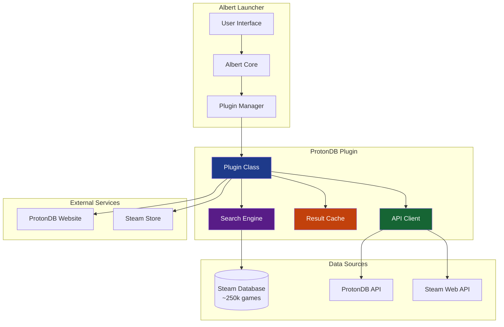
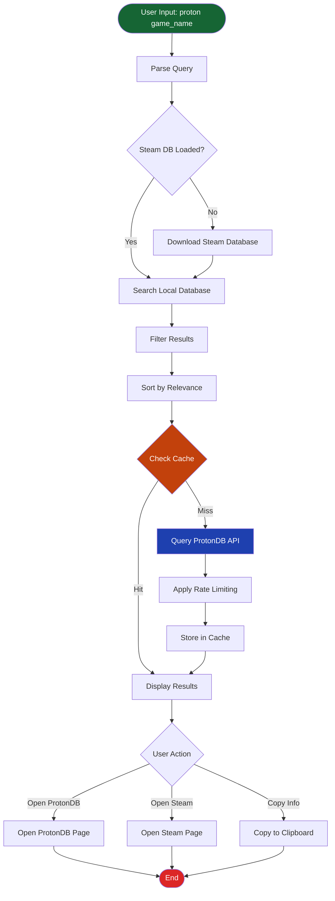
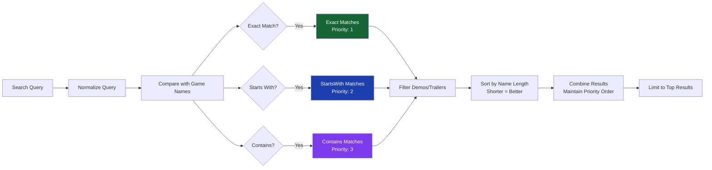
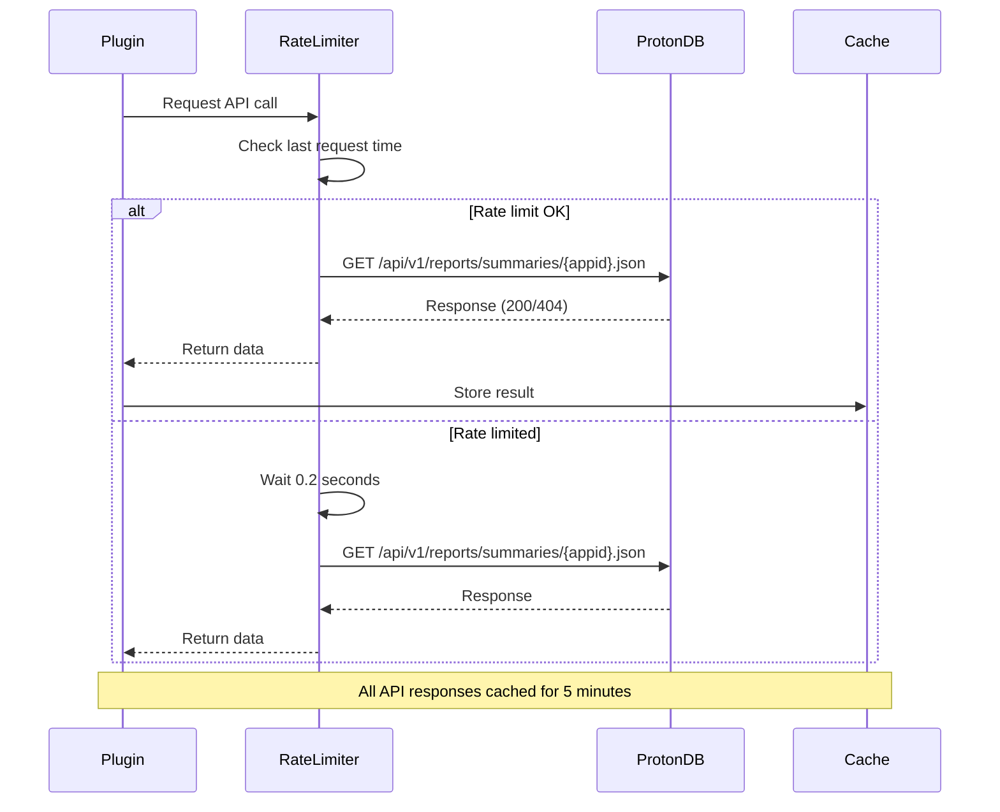
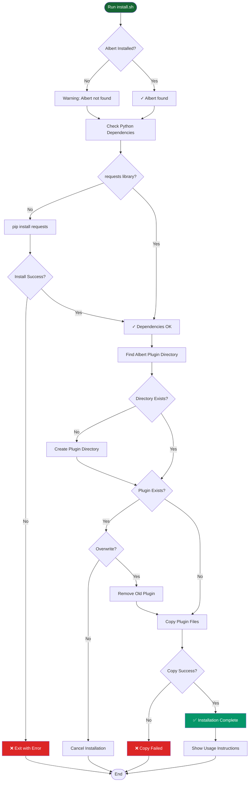
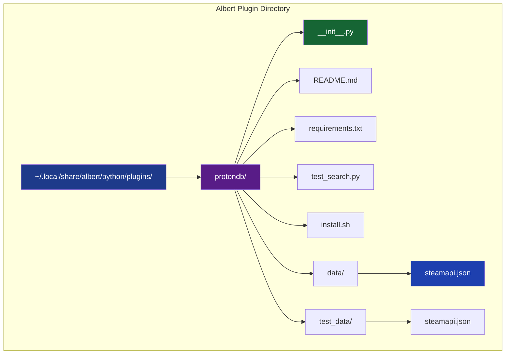
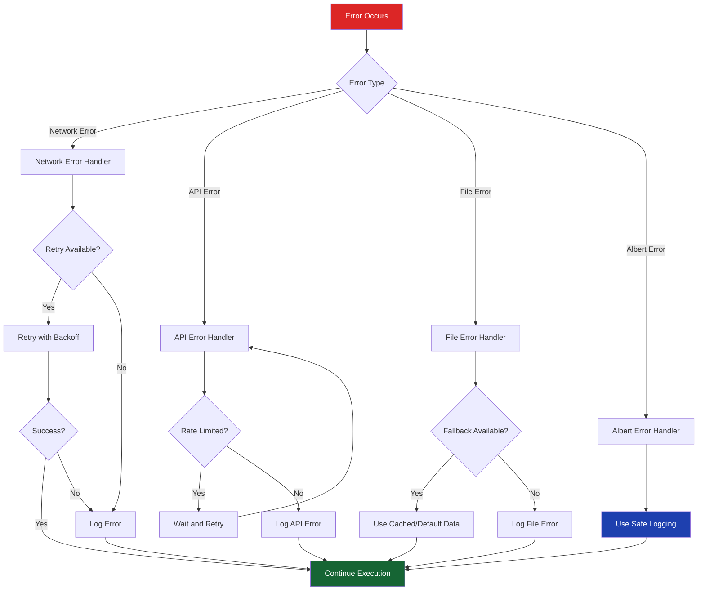
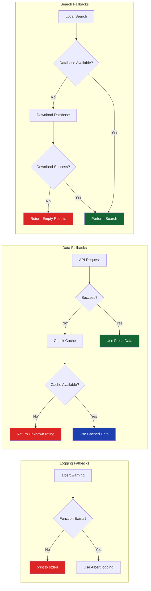

# ProtonDB Search Plugin - Comprehensive Documentation

## Table of Contents
1. [Overview](#overview)
2. [System Architecture](#system-architecture)
3. [Data Flow](#data-flow)
4. [Search Algorithm](#search-algorithm)
5. [API Integration](#api-integration)
6. [Installation Process](#installation-process)
7. [Error Handling](#error-handling)

## Overview

The ProtonDB Search Plugin is an Albert launcher extension that enables users to search for Steam game compatibility ratings directly from the Albert interface. The plugin integrates with ProtonDB's community-driven database to provide real-time compatibility information for Windows games running on Linux via Steam's Proton.

## System Architecture

## Data Flow

### Search Process Flow

## Search Algorithm

### Match Prioritization Logic

## API Integration

### ProtonDB API Flow

## Installation Process

### Installation Workflow

### File Structure After Installation

## Error Handling

### Error Handling Strategy

### Fallback Mechanisms

---

## Conclusion

This comprehensive documentation provides a complete technical overview of the ProtonDB Search Plugin for Albert. The plugin demonstrates best practices in Python development, API integration, error handling, and user experience design. The modular architecture ensures maintainability and extensibility for future enhancements.

For additional information, please refer to the README.md, CHANGELOG.md, and the extensive test suite included with the plugin.